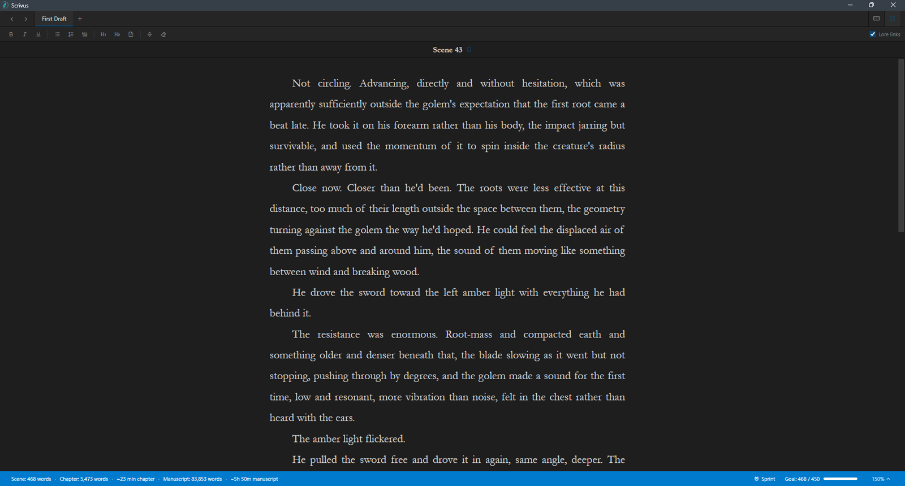
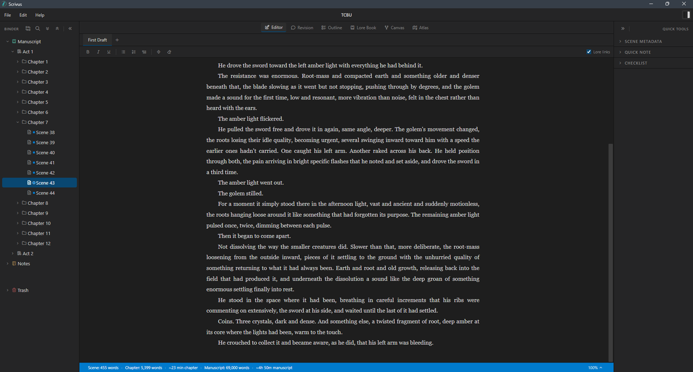
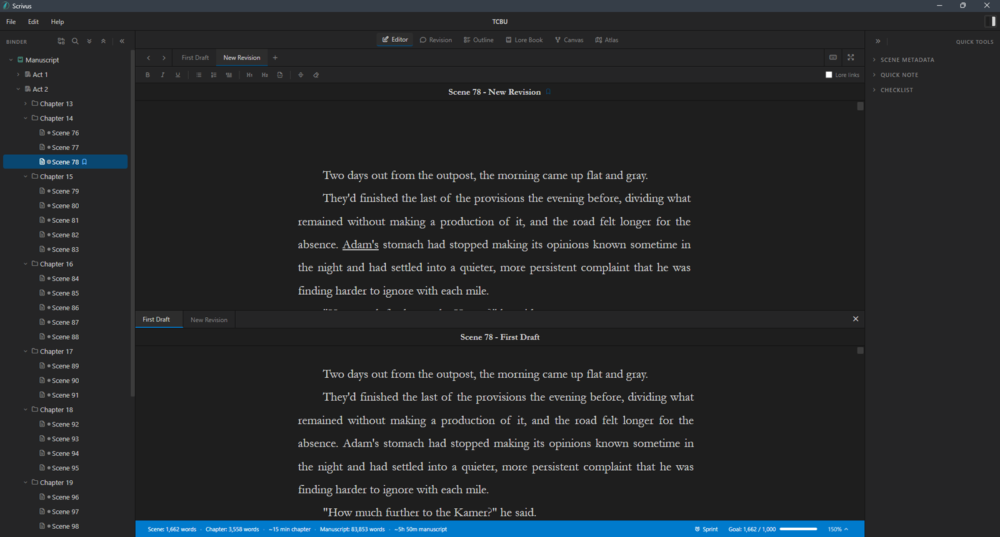
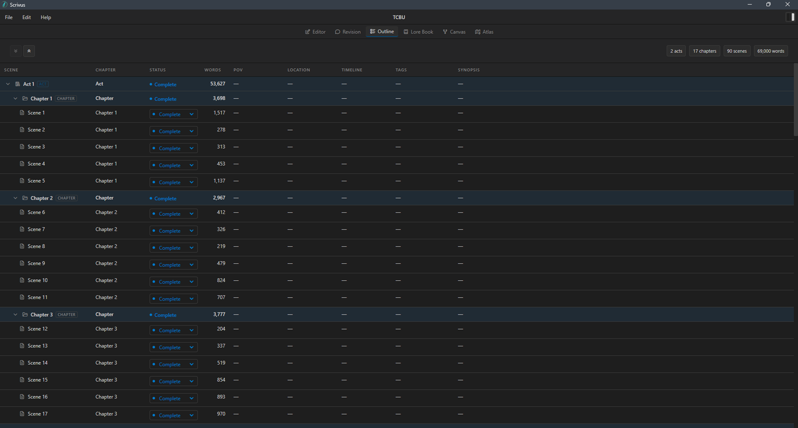
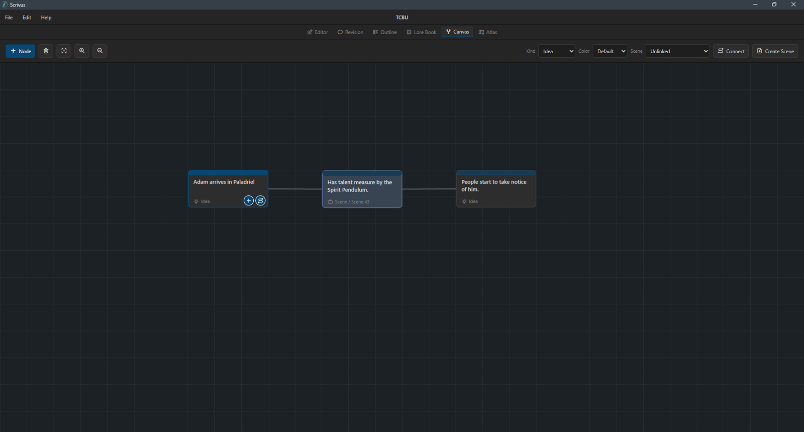
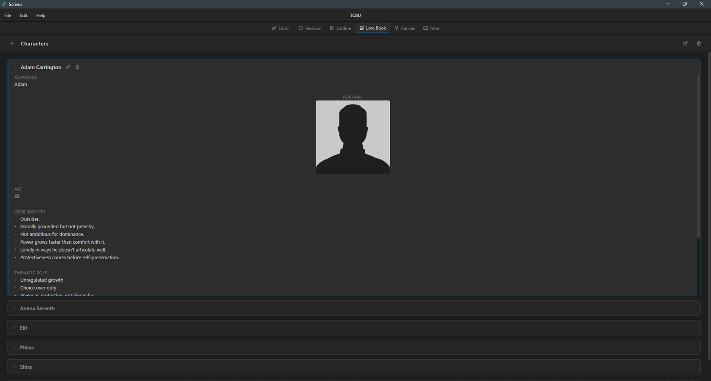
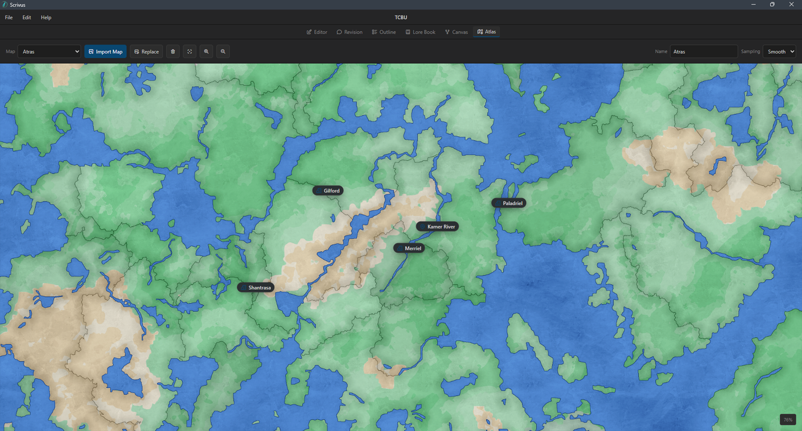
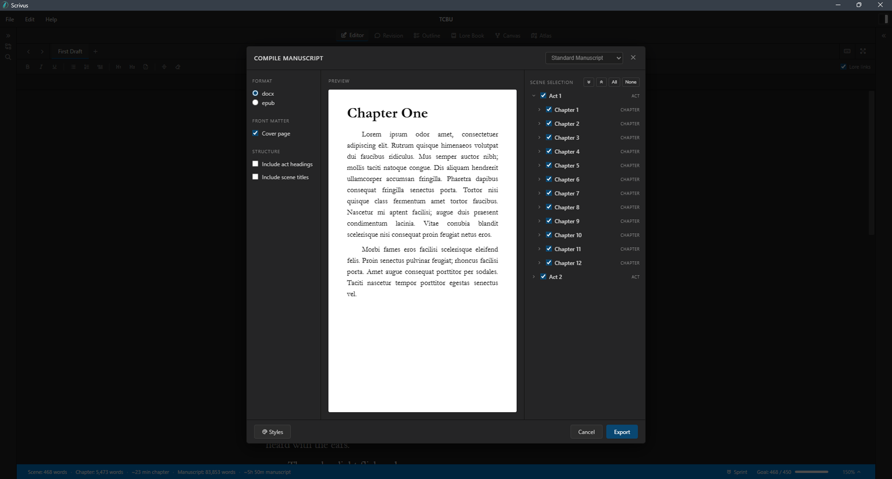
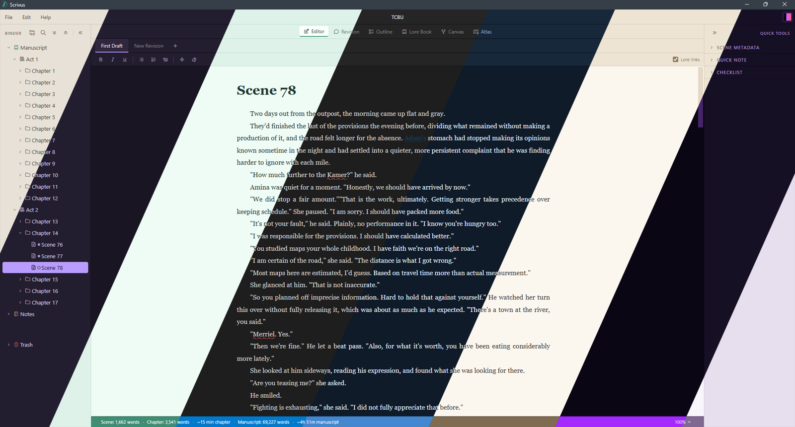
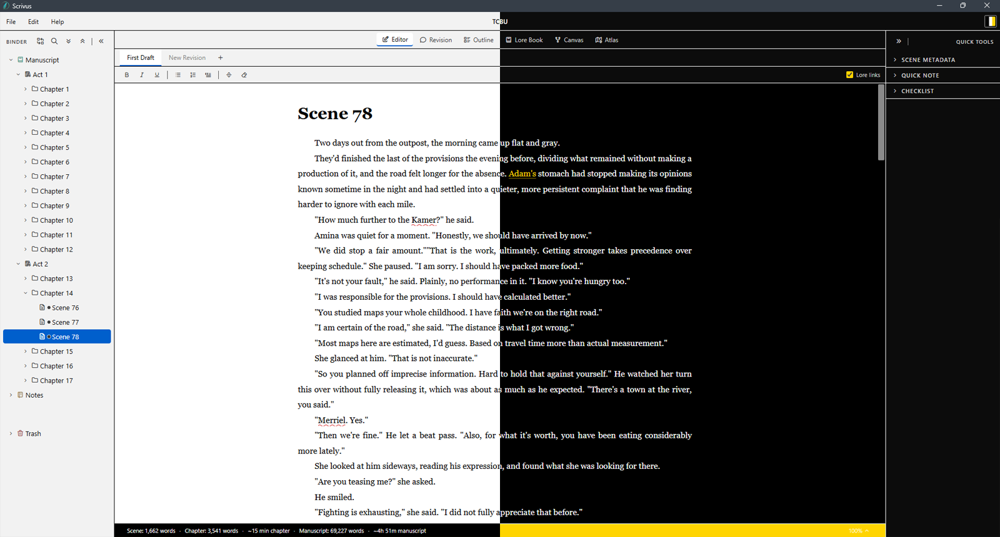

# Scrivus

Scrivus is a local-first writing app for drafting, organizing, planning, and compiling long-form fiction projects. It is built for writers who want their manuscript, notes, lore, planning board, maps, and backups to live together in one project folder without relying on a cloud service.

Projects are stored as `.scrivus` folders on your computer. Your writing stays local, and Scrivus keeps project data in readable project files alongside scene documents and managed assets.

[](https://www.youtube.com/watch?v=vYGEWtNUxNw)

Watch a quick overview of what Scrivus can do: [Scrivus video demo](https://www.youtube.com/watch?v=vYGEWtNUxNw).



## Features

- Draft manuscripts in a focused rich-text editor with formatting controls for prose, lists, block quotes, scene breaks, and underline.
- Compare drafts in a horizontal split-view reference pane while editing another draft version.
- Organize chapters, scenes, notes, and folders in a binder with drag-and-drop, multi-select actions, trash, restore, and duplicate tools.
- Track scene metadata including status, POV, location, timeline, tags, and synopsis.
- Review manuscript structure in the Outline workspace with chapter and scene rows, word counts, and editable scene status.
- Plan visually with Canvas, a freeform board for ideas, scenes, characters, locations, notes, labels, and connections.
- Build a Lore Book with custom categories, reusable templates, image fields, keywords, and editor lore-link highlights.
- Manage maps in Atlas with imported map images, multiple maps, zooming, panning, marker labels, marker types, and visibility levels.
- Compile selected manuscript content to `.docx`, with optional front matter, scene titles, Standard Manuscript styling, and Proof Copy styling.
- Import a `.docx` manuscript into a new Scrivus project, splitting Act, Chapter, and Scene headings into manuscript structure.
- Keep project backups with configurable retention, manual backup, and restore flows.
- Use global themes, recent projects, project compatibility checks, recovery options, and update checks from GitHub Releases.

## Workspaces

### Editor

The Editor workspace is the main drafting surface. It pairs the binder, scene tabs, formatting toolbar, manuscript editor, inspector, scene metadata, spellcheck, and optional lore-link highlights.



When a scene has multiple draft tabs, the Editor can open a read-only split-view reference pane. This lets you edit the active draft while viewing another draft below it, with comment highlights available as hover previews.



### Outline

Outline gives a manuscript-level view of chapters and scenes, including word counts and metadata. It is useful for scanning structure and updating scene status without opening each scene one by one.



### Canvas

Canvas is a freeform planning board for story structure, relationships, and loose ideas. Nodes can represent ideas, scenes, characters, locations, and notes, with labeled connections between them.



### Lore Book

The Lore Book stores worldbuilding and reference material in customizable categories. Categories can define their own fields, long text areas, image fields, and dividers, then entries can be linked back into the editor through names and keywords.



### Atlas

Atlas keeps maps inside the project. Import a map image, place markers, choose marker types, adjust labels, and control when markers appear at different zoom levels.



### Compile

The compile flow lets you choose which chapters and scenes to export, include optional front matter, optionally include scene titles, and generate a `.docx` manuscript. Standard Manuscript uses the project styles configured in Scrivus. Proof Copy exports a monospaced, double-spaced, justified manuscript with first-line indents and proof-style headings.



## Project Format

New projects are created as `.scrivus` project folders. A project contains `project.json`, scene files, Canvas data, Atlas data, Lore Book data, managed images, and backups.

Scrivus can also create a new project from a Word `.docx` manuscript. During import, headings such as `Act X`, `Chapter X`, and `Scene X` are converted into Scrivus folders and scenes. Supported Word formatting includes bold, italic, underline, bulleted lists, and numbered lists.

Scrivus includes project metadata with both the Scrivus app version and a project format version. If a project was created by a newer incompatible version, Scrivus warns before opening it.

See [PROJECT_FORMAT.md](PROJECT_FORMAT.md) for more details.

## Privacy

Scrivus is local-first. Project content is stored on your machine, and the app does not require an account. The update checker contacts GitHub Releases only when you choose **Help > Check for Updates**.

See [PRIVACY.md](PRIVACY.md) for the full privacy note.

## Themes

Scrivus includes 20 built-in themes, with light and dark options for different writing environments. The set also includes high-contrast light and dark themes for visually impaired users who need stronger separation between text, panels, and controls.




## Installing

Scrivus releases are distributed through GitHub Releases.

1. Download the latest installer from the [Scrivus releases page](https://github.com/ObsydianX/Scrivus/releases).
2. Run the installer.
3. Launch Scrivus and create or open a project.

## Development

Scrivus is built with Tauri, React, TypeScript, and Vite.

```bash
npm install
npm run dev
```

To build the frontend:

```bash
npm run build
```

To run through Tauri:

```bash
npm run tauri dev
```

## License

Scrivus is released under the MIT License.

See [LICENSE.txt](LICENSE.txt).
