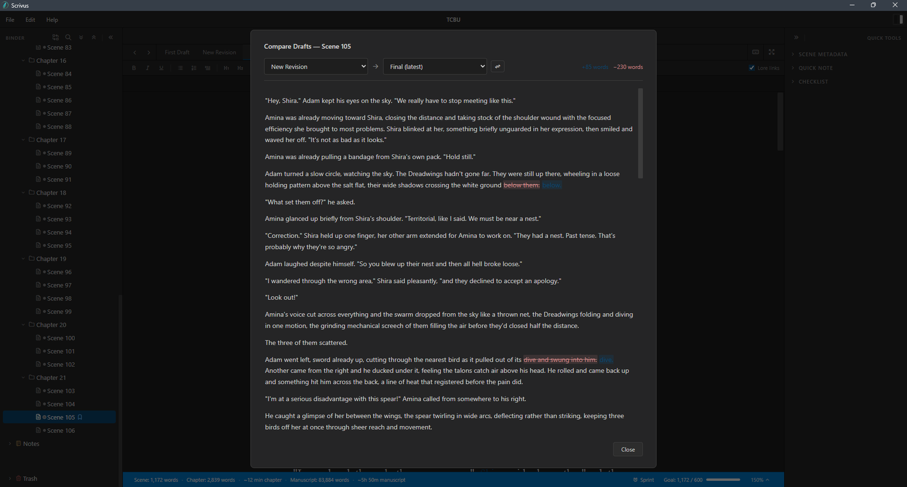
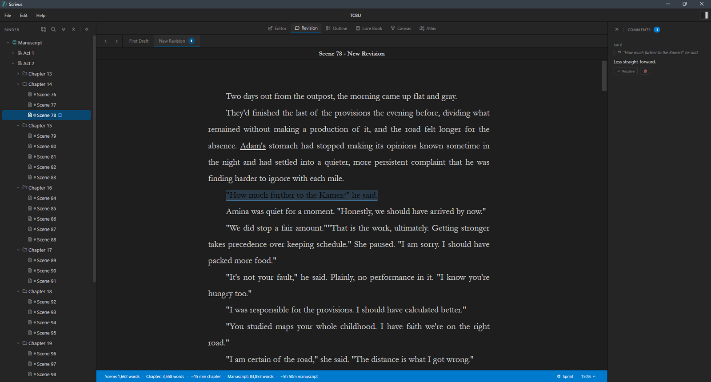

# Scrivus

Scrivus is a local-first writing app for drafting, organizing, planning, and compiling long-form fiction projects. It is built for writers who want their manuscript, notes, lore, planning board, maps, and backups to live together in one project folder without relying on a cloud service.

Projects are stored as `.scrivus` folders on your computer. Your writing stays local, and Scrivus keeps project data in readable project files alongside scene documents and managed assets.

## Videos

[](https://www.youtube.com/watch?v=vYGEWtNUxNw)

Watch a quick overview of what Scrivus can do: [Scrivus video demo](https://www.youtube.com/watch?v=vYGEWtNUxNw).

###

[](https://www.youtube.com/watch?v=Dqo_YhbOqbU)

Version 0.3.0 Update: [Scrivus video update](https://www.youtube.com/watch?v=Dqo_YhbOqbU).


## Features

- Draft manuscripts in a focused rich-text editor with draft tabs, scene navigation, focus mode, typewriter scrolling, formatting controls, writing goals, writing sprints, and optional lore-link highlights.
- Compare drafts in a horizontal split-view reference pane while editing another draft version, or open a dedicated draft comparison view with word-level change highlights.
- Review scenes in a read-only Revision workspace with anchored comments, comment counts, resolved threads, per-draft review tabs, and scene navigation.
- Organize chapters, scenes, notes, and folders in a binder with drag-and-drop, multi-select actions, trash, restore, and duplicate tools.
- Track scene metadata including status, POV, location, timeline, tags, and synopsis.
- Review manuscript structure in the Outline workspace with chapter and scene rows, word counts, editable scene status, and a collapsible pacing strip.
- Plan visually with Canvas, a freeform board for titled ideas, scenes, characters, locations, notes, color labels, and connections.
- Build a Lore Book with custom categories, subcategories, reusable templates, image fields, pinned entries, backlinks, keywords, editor lore-link highlights, and a chapter-by-chapter presence chart.
- Manage maps in Atlas with imported map images, multiple maps, zooming, panning, marker search, marker categories, visibility toggles, and Lore Book-linked markers.
- Compile selected manuscript content to `.docx` or `.epub`, with remembered act, chapter, scene, and draft-tab selections, cover image support, and standard, proof copy, and Shunn manuscript presets.
- Import a `.docx` manuscript into a new Scrivus project, splitting Act, Chapter, and Scene headings into manuscript structure.
- Keep project backups with configurable retention, manual backup, and restore flows.
- Use global themes, recent projects, project compatibility checks, recovery options, and update checks from GitHub Releases.

## Workspaces

### Editor

The Editor workspace is the main drafting surface. It pairs the binder, scene tabs, formatting toolbar, manuscript editor, inspector, scene metadata, spellcheck, writing goals, writing sprints, and optional lore-link highlights.

Scene navigation buttons move through manuscript order without leaving the keyboard-heavy drafting flow. Focus mode hides the outer app chrome while keeping the draft tabs, editor toolbar, and status bar available. Typewriter scrolling can keep the caret line centered while you write, and the sprint timer tracks word progress for timed sessions. Scrivus also remembers the last opened scene and active draft tab when a project is reopened.


When a scene has multiple draft tabs, the Editor can open a read-only split-view reference pane. This lets you edit the active draft while viewing another draft below it, with comment highlights available as hover previews.

Selected editor text can be linked to existing Lore Book entries or used to create a new Lore Book entry through the context menu. When lore links are enabled, matching entry names and keywords are highlighted in the manuscript.


### Draft Difference

Draft Difference compares two draft tabs from the same scene so revisions can be reviewed before old text is discarded. Open it from a draft tab context menu, choose the two drafts to compare, then scan paragraph-level changes with word-level added and removed highlights.

The view counts inserted and deleted words, supports swapping the comparison direction, and focuses on text changes rather than formatting-only edits.



### Revision

Revision provides a dedicated read-only review workspace for scene-level feedback. Select a scene from the binder, switch between that scene's draft tabs, highlight text to add an anchored comment, then resolve, reopen, or delete comments from the comments pane.

Comments are scoped to the active scene and draft tab, so feedback for an earlier draft stays separate from notes on a later revision. Active comments are highlighted in the manuscript view, unresolved comment counts appear on draft tabs, resolved comments move out of the active count, and the comments pane can collapse when you want more room to read.



### Outline

Outline gives a manuscript-level view of chapters and scenes, including word counts and metadata. It is useful for scanning structure and updating scene status without opening each scene one by one. A collapsible pacing strip summarizes scene length and status across the manuscript, with bars grouped by chapter and a guide line for average scene length.


### Canvas

Canvas is a freeform planning board for story structure, relationships, and loose ideas. Nodes can represent ideas, scenes, characters, locations, and notes, with labeled connections between them.

Nodes support titles, auto-expanding note areas, color labels, a color legend, duplication, and quick scene creation. When a node creates a scene, Scrivus uses the node title before falling back to the node notes.


### Lore Book

The Lore Book stores worldbuilding and reference material in customizable categories and subcategories. Categories can define their own fields, long text areas, image fields, and dividers, then entries can be linked back into the editor through names and keywords.

Entries open in a dedicated viewer with pinned-entry shortcuts, backlinks to matching manuscript scenes, and incremental "show more" loading for large projects. The presence chart shows where entries in a category appear across chapters, making it easier to spot absent characters, overloaded locations, or continuity gaps. Editor context menus can link selected text to an existing entry or create a new entry directly from that selection.


### Atlas

Atlas keeps maps inside the project. Import a map image, place markers, choose marker types, adjust labels, and control when markers appear at different zoom levels.

Atlas supports multiple marker categories, category visibility toggles, a searchable marker list, and in-map controls for choosing, renaming, and sampling maps. Markers can be linked to existing Lore Book entries or used to create new Lore Book entries, and destructive map deletion requires confirmation.


### Compile

The compile flow lets you choose which acts, chapters, scenes, and draft tabs to export, include optional front matter, optionally include scene titles, and generate either a `.docx` manuscript or an `.epub` ebook. Standard Manuscript uses the project styles configured in Scrivus. Proof Copy exports a monospaced, double-spaced, justified manuscript with first-line indents and proof-style headings. Manuscript (Shunn) exports a submission-style DOCX with Times New Roman 12, double spacing, first-line indents, a running header, centered scene breaks, and an END marker.

Compile selections are remembered per project, and deselecting a parent act or chapter updates its child items so the export tree stays predictable. EPUB exports include a table of contents, optional title page, project book metadata, and an optional cover image from Project Settings.


## Project Format

New projects are created as `.scrivus` project folders. A project contains `project.json`, scene files, Canvas data, Atlas data, Lore Book data, managed images, cover images, compile selections, writing stats, and backups.

Scrivus can also create a new project from a Word `.docx` manuscript. During import, headings such as `Act X`, `Chapter X`, and `Scene X` are converted into Scrivus folders and scenes. Supported Word formatting includes bold, italic, underline, bulleted lists, and numbered lists.

Scrivus includes project metadata with both the Scrivus app version and a project format version. If a project was created by a newer incompatible version, Scrivus warns before opening it.

See [PROJECT_FORMAT.md](PROJECT_FORMAT.md) for more details.

## Privacy

Scrivus is local-first. Project content is stored on your machine, and the app does not require an account. The update checker contacts GitHub Releases when Scrivus starts and when you choose **Help > Check for Updates**.

See [PRIVACY.md](PRIVACY.md) for the full privacy note.

## Themes

Scrivus includes 20 built-in themes, with light and dark options for different writing environments. The set also includes high-contrast light and dark themes for visually impaired users who need stronger separation between text, panels, and controls.


## Installing

Scrivus releases are distributed through GitHub Releases.

1. Download the latest installer from the [Scrivus releases page](https://github.com/ObsydianX/Scrivus/releases).
2. Run the installer.
3. Launch Scrivus and create or open a project.

## macOS

macOS builds are currently unsigned. If macOS reports that Scrivus is damaged, move Scrivus.app to Applications, then run:

```bash
xattr -dr com.apple.quarantine /Applications/Scrivus.app
open /Applications/Scrivus.app
```

## Development

Scrivus is built with Tauri, React, TypeScript, and Vite.

Development and release builds require Node.js 24.

```bash
npm install
npm run dev
```

To build the frontend:

```bash
npm run build
```

To run through Tauri:

```bash
npm run tauri dev
```

## License

Scrivus is released under the MIT License.

See [LICENSE.txt](LICENSE.txt).
